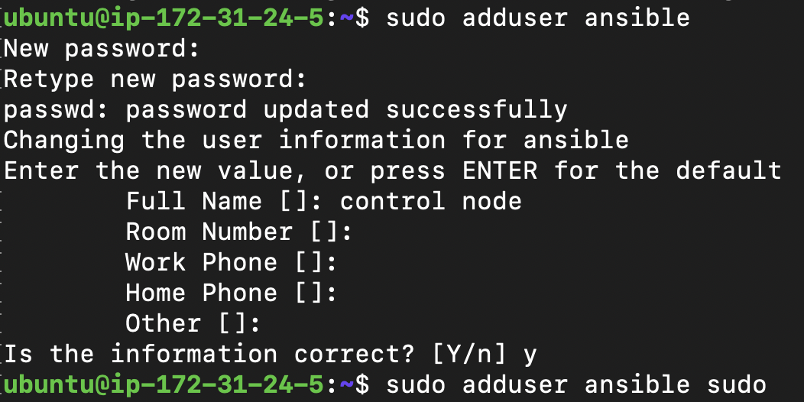
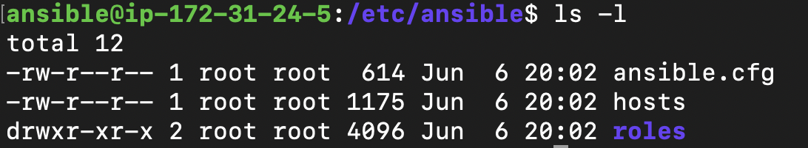
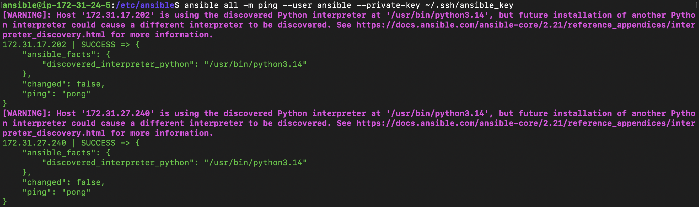
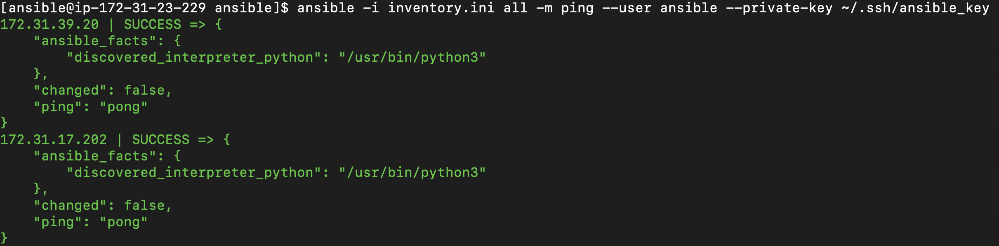
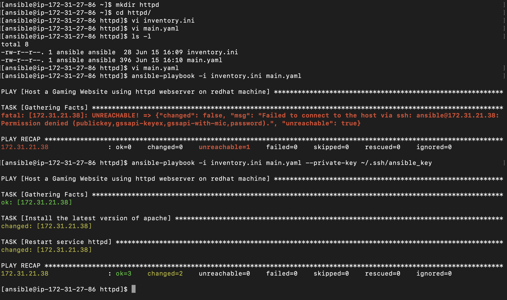
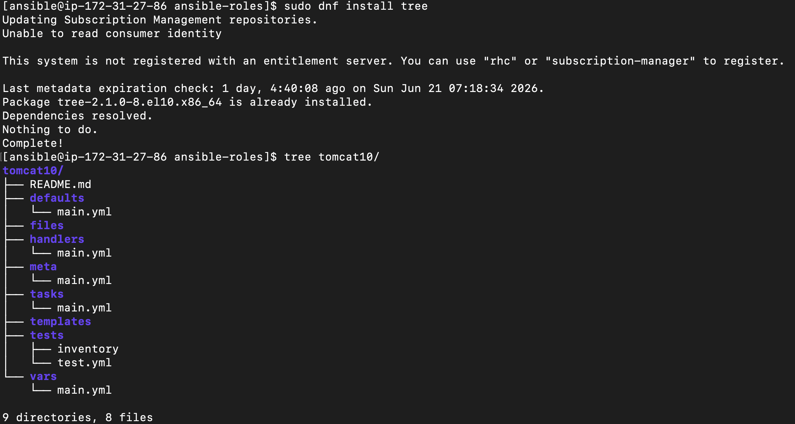

# **DevOps Configuration Management tool - Ansible**

## **Configuration Management**

* **Configuration Management (CM)** is an IT process that ensures all software and hardware systems maintain a consistent desired state. It automates the setup, maintenance, and tracking of servers and infrastructure, eliminating manual errors and configuration drifts.

* To be more detailed, an egineering process for establishing and maintaining consistency of product's performance, functional, and physical attributes with its requirements design and operational information throughtout its life.

* Types of Configuration Management
    * Configuration Management tools generally falls into two main operational categories based on how they apply updates:

    - Push Based Configuration Management
        * Master server pushes configuration directly to target nodes.
        * Target system do not need to pull updates.
        * Requires `SSH` or `WinRM` access to targets.
        * Example: **Ansible**.
            - **[Ansible](https://ansible.com):**
                * Architecture: Agentless.
                * Language: YAML.
                * Control: Push-based over `SSH`.
    
    - Pull Based Configuration Management
        * Agents installed on target nodes periodically check a master server.
        * Agents pull down the latest configuration if changes occur.
        * More scalable for massive environments.
        * Example: **Puppet, Chef**.
            - **[Puppet](https://puppet.com):**
                * Architecture: Agent-master.
                * Language: Puppet DSL (Domain Specific Language).
                * Control: Pull-based.
            - **[Chef](https://chef.io):**
                * Architecture: Angent-master.
                * Language: Rubby-based DSL.
                * Control: Pull-based.
            - **[SaltStack](https://saltproject.io):**
                * Architecture: Master-minion (can be agentless).
                * Language: Phython/YAML
                * Control: Speed focused push/pull via ZeroMQ.

### Ansible           

* Ansible is a open-source automation platform sponsored by Red Hat. It is highly popular due to its low barrier to entry and simple architecture.

* **Key Characteristics** 
    - **Agentless**: No software needs to be installed on target nodes.
    - **Idempotent**: Running a script multiple times yields excat same result without repeating completed tasks.
    - **Declarative/Procedural Hybrid**: You define the desired state, Ansible figures out how to achieve it.

* **Use Cases**
    - **Configuration Management**: Istall/Update package manager, manage files and services
        * Debian -> Ubuntu, debian, .. etc (`apt` package manager).
        * Redhat -> CentOS, redhat linux, amazon linux, ..etc (`yum` or `dnf`).
        * Windwos -> `choco` or `winget`.
    - **Application Deployment**: Deploys application code in multiple server.
        * Example: Deploys artifacts to tomcat webserver.
    - **Orchestration**: Ansible handles orchestration by executing automated steps in a strict, step by step order accross multiple servers form a single central machine.
        * Example: Setting up kubernetes cluster.
    - **Provisioning**: Creates resources in any cloud (AWS/Azure/GCP).

* **Core Concepts**    
    - **Control Node**: The machine where Ansible is installed and executed from.
    - **Managed/Worker Nodes**: The target servers managed by the control node.
    - **inventory**: A file (hosts) listing the IP addresses/domains of managed nodes.
    - **Modules**: Small plugins that execute specific tasks (e.g., installing a package, copying a file).
    - **Playbooks**: `YAML` file where automation tasks are defined and ordered.
    - **Ad-hoc**: Adhoc command is a single, quick task run directly from your terminal using the `ansible` command. It is used to perform immediate actions, like. checking server disk space or restarting a service-without writing a formal automation script (playbook).
        Example: `ansible all -m ping` used to check if servers are reachable.

* **Ansible Architecture**:
    
    - *Note*: 
        * We need to create users and provide sudo permissions both on ansible server as well as on worker nodes.
        * Their is a file called `known_hosts` which lies inside `.ssh` directory, it is a local database that stores the unique public keys (host keys) of all remote servers you have previously connected via `ssh`.

* **Core Requirements**
    - **Control Node**: A system running Linux, MacOS, or WSL (Windows subsystem for Linux) with *python 3.9* or newer installed.
    - **Ansible Package**: Installed on the control node, typically via `pip` (Python's package installer) or your OS's package manager.
    - **Target Nodes**: The remote server or devices you want to change. They only require: 
        * A running `SSH` server.
        * A user account with permissions to execute commands (and often sudo privileges of system-level changes)
        * Python3 installed (to run complex modules).
    - **Target accessibility**: The control node must be able to resolve the hostnames and IP addresses of the target node and reach them over the network (usually via port22).

#### **Ansible Environment Setup (AWS)**

##### **Using 3 ubuntu instances** (`ubuntu-ansible-server`, `ubuntu-worker-1`, `ubuntu-worker-2`)

###### **Create Ansible Server**: 
  * sign in to  the AWS Management Console.
  * Go to **EC2 Dashboard** and click Launch Instance.
  * Enter the instance name as `ubuntu-ansible-server`.
  * Select Ubuntu as operating system.
  * Choosen the required instance type (auto-selected free-tier).

###### **Configure the Key Pair**:
  * Select an exisiting key pair or create a new one.
  * A key pair is used to securely connect to your EC2 instance using `SSH`.

###### **Configure Network Settings**:
  * if you want the instance to be in a specific environment, choose the required **VPC**. Otherwise, use the default VPC.
  * Select an existing security group or create a new one.
  * Allow SSH (port 22) so you can connect to the instance.
  * if you plan to host a website, then allow:
      - HTTP (Port 80)
      - HTTPS (Port 443)

###### **Launch the Instance**:
  * Review the settings and click Launch Instance.

###### **Create Worker Nodes**:
  * Repeat the same process to create two additional Ubuntu instances
      - ubuntu-worker-1
      - ubuntu-worker-2
  * At the end of the setup, you should have, 1 Ansible Server (`ubuntu-ansible-server`) and 2 Worker Nodes (`ubuntu-worker-1` & `ubuntu-worker-2`).

###### **Connect to the Ansible Server**:
  * Use your .pem file (key) to connect to the `ubuntu-ansible-server` instance. i.e ssh -i /Users/jagadeesh/Downloads/ansible-keypair.pem ubuntu@<PUBLIC_IP_ADDRESS>
  * *Note*: Before getting into further step first we need to do update and upgrade the linux system i.e `sudo apt update`

###### **Create the Anisble User**:
  * Create a new user named `ansible`, i.e `sudo adduser ansible`.
    - When prompted for a password, you can use `ansible@123` (any passwd of your choice).
    - Re-enter the password to confirm.
    - Press Enter for the remaining optional fields (Name, ..etc).
    - Type Y when asked if the infomation is correct.
    

###### **Add the User to Sudo Group**:
  * `sudo adduser ansible sudo`
  * To verify if the user has been added to sudo group, give `groups ansible`

###### **Grant Passwordless Sudo Access**:
  * Create a Sudoers file:
    `sudo vi /etc/sudoers.d/ansible`
  * you will navigate to vim editor, now press `i` to enter insert mode and add:
    - `ansible ALL=(ALL) NOPASSWD:ALL`
  * Save and exit by pressing `Esc` and type `wq!`

###### **Set Read Permissions**:
  * Now set read permissions for user and group i.e `sudo chmod 440 /etc/sudoers.d/ansible`
  * *Note*: Needed only for ansible control node.

###### **Enable Password Authentication for the Ansible User**:
  * Create and edit the SSH configuration file i.e `sudo nano /etc/ssh/sshd_config.d/10-password-login-for-special-user.conf`
  * Add the following:
    ```nano
    Match User ansible
      PasswordAuthentication yes
    ```
    - Save the file and exit.

###### **Restart the SSH Service**:
  * `sudo systemctl restart ssh.service`

###### **Verify the configuration**:
  * From the server (ubuntu<PUBLIC_IP_ADDRESS>), try logging in as the `ansible` user i.e `sudo ssh ansible@<PUBLIC-IP-ADDRESS>`. When prompted, enter the password. If the login succeeds, the configuration is working correctly.

###### **Repeat on the Worker Nodes**:
  * `ubuntu-worker-1`
  * `ubuntu-worker-2`
  * *Note*: You can skip the following command on the worker nodes i.e `sudo chmod 440 /etc/sudoers.d/ansible`

###### **Install Python on All Instances**:
  * Why ansible require python on all the instances?
      * **Server Execution**: The Ansible software itself is written in Python and needs it on the server to read your playbooks and manage connections
      * **Node Execution**: Ansible works by pushing temporary scripts (modules) to the nodes; the nodes need Python to run these scripts locally.
      * **Communication**: The Python scripts running on the nodes gather system data and format the results into JSON to send back to the server.
  * Ansible uses Python on the managed (worker) nodes to execute modules and ad-hoc commands. Therefore, Python should be installed on all instances
    - Ansible Server (Control Node)
    - Worker Node 1 
    - Worker Node 2

  * **Update the Package of the OS (Ubuntu)**
    - Run the following command on each instance `sudo apt update`

  * **Install Python3 and pip**
    - `sudo apt install python3 python3-pip -y`, `-y` automatically answers "Yes" to the installation prompts.
    - Now verify the Python version, you should see the latest version of Python.
        * `python3 --version`

###### **Install Ansible on the Control Node**:
  * Ansible follows a push-based architecture, meaning the control node connects to worjer nodes over SSH and executes tasks remotely. Therefore, Ansible only needs to be installed on the Ansible Server (Control Node).
  * Run the following commands on Ansible Server Node:
    ```
    sudo apt install software-properties-common -y
    sudo add-apt-repository --yes --update ppa:ansible/ansible
    sudo apt install ansible -y
    ```
  * Verify the version of Ansible `ansible --version`, you should see the latest version of Ansible.
  * *Note*: 
    - The default ansible configuration will be stored in `/etc/ansible`
    - If the Ansible server was running in ubuntu machine then you can see `ansible.config`, `hosts`, `roles` files in `/etc/ansible` directory (hosts nothing but a **default** inventory file).

###### **Configure Passwordless SSH Authentication for Ubuntu Machine**    
  * To allow the Ansible to connect to worker nodes without enterning a password each time, configure SSH Key-based authentication.
  * **Generate an SSH Key Pair**
    * Log in as the `ansible` user on the Ansible Server Node and generate a new key pair i.e `ssh-keygen -t ed25519 -f ~/.ssh/ansible_key`, Press Enter to accept the default prompts if no passphrase is required.
    * This creates:
        - `~/.ssh/ansible_key` -> Private Key (Keep this secure on the Ansible Server)
        - `~/.ssh/ansible_key.pub` -> Public Key (copy this to worker nodes)
  * **How Ansible uses SSH**
    * Ansible expects Python on nodes; it operates primarily over SSH and Python.
    * At runtime, Ansible reads the IP addresses and credential details from the inventory file, which configures the underlying SSH connection options.
    * Ansible initiates an internal SSH connection to the target system.
    * It generates a temporary Python script containing your task configurations and copies it over to the managed node.
    * The Python interpreter on the remote node executes this temporary script.
    * The script execution output is returned to the control machine via the SSH connection.
    * Ansible automatically cleans up the temporary Python script and all related runtime files from the node.
    * As users, we interact with Ansible by writing structured playbooks or executing ad-hoc commands to orchestrate these tasks.
    * Industry standards recommend configuring a dedicated user across all target nodes using key-based SSH authentication, typically provisioned with sudo or privilege escalation rights.

###### **Copy the Public Key to Worker Nodes from Ubuntu Ansible Server**:
  * Copy the public key to worker node 1 & 2
    `ssh-copy-id -i ~/.ssh/ansible_key.pub ansible@<worker-1-PRIVATE_IP_ADDRESS>` and `ssh-copy-id -i ~/.ssh/ansible_key.pub ansible@<worker-2-PRIVATE_IP_ADDRESS>`. Enter the `ansible` user's password when prompted. The public key will be added to the worker node's `authorized_keys` file.
  * *Note*: Why use the <PRIVATE_IP_ADDRESS> ?
    Since all instances are in the same AWS VPC. they can communicate using their private IP addresses. Using private IPs avoids issues caused by changing public IPs when re-starting the instances and also keeps traffic within the AWS network

###### **Verify Passwordless SSH Access from Ubuntu Ansible Server**:
  * From the Ansible Server, test connectivity to reach worker node i.e `ssh -i ~/.ssh/ansible_key ansible@<worker-1-PRIVATE_IP_ADDRESS>` and `ssh -i ~/.ssh/ansible_key ansible@<worker-2-PRIVATE_IP_ADDRESS>`. If the configuration is correct, you should log in without being prompted for the `ansible` user's password.
  * *Note*: If you generated the SSH Key while logged in as `ubuntu`, switch to the `ansible` user (`su ansible`) and generate the key there. This keeps the key in the `ansible` user's home directory and makes it easier for Ansible to use it.

###### **Configure the Ansible Inventory**:
  * Ansible uses an inventory file to keep track of the hosts (managed nodes) it needs to connect to. By default, the inventory file is named `hosts` and is located in the `/etc/ansible` directory.
  * **View the Default Ansible Files**
    - Log in as the `ansible` user on the Ansible Server and navigatebto the Ansible configuration directory i.e `cd /etc/ansible` and give `ls -l`. 
    - You should see files and directories similar to
      * `ansible.cfg`: Ansible configuration file
      * hosts`: The default inventory file where managed nodes are listed.
      * `roles/`: Directory used for organizing Ansible roles.

###### **Add Worker Nodes to the Inventory (hosts)**:
  * Open the default inventory file i.e `sudo vi hosts`. At the bottom of the file, add the private IP addresses of your worker nodes: (Save and Exit the file)
    - WORKER-1-PRIVATE-IPADDRESS
    - WORKER-2-PRIVATE-IPADDRESS
        
###### **Test Connectivity with an Ansible Ping**:
  * Once the inventory is configured, you can verify that Ansible can connect to all managed nodes by running the `ping` module i.e `ansible all -m ping --user ansible --private-key ~/.ssh/ansible_key`.

    * **Explanation of the Command**
      - `all`: Targets all hosts listed in the inventory file (`/etc/ansible/hosts`).
      - `-m ping`: Uses Ansible's built-in `ping` modules to check connectivity. This is not an ICMP network ping; it verifies that Ansible can log in and execute Python on the remote hosts.
      - `--user ansible`: Connects to the remote machines using the `ansible` user.
      - `--private-key ~/.ssh/ansible_key`: Uses the specifies SSH private key for authentication.
        
    * **Authentication Methods**
      - Ansible supports multiple ways to authenticate with remote hosts:
        * **1. Password Based Authentication**:
          - `ansible all -m ping --user ansible --ask-pass`, with this methodd you will be prompted to enter the user's password.
        * **SSH Key based authentication**:
          - `ansible all -m ping --user ansible --private-key ~/.ssh/ansible_key`, This method uses the SSH key pair configured earlier and avoids entering a password each time.
        
      - *Note*: If you are using a custom inventory file (for example, `inventory.ini`) instead of the default `hosts` file, specify it with the -i option i.e `ansible -i inventory.ini -m ping --user ansible --private-key ~/.ssh/ansible_key`

      - The response when running above command looks like 

##### **Setting Up a Mixed Ansible Environment**
  * The environment setup for 
    - `redhat-ansible-server`
    - `ubuntu-worker-1` 
    - `redhat-worker-2`

  * In this section, I am demonstrating the configuration only for the RedHat instance. You can apply the same configuration steps to the RedHat worker node as well. For the Ubuntu worker node, follow the Ubuntu specific configuration steps provide in previous sections. 

  * In this setup, we will use: 
    - Ansible Server (Control Node): Red Hat Enterprise Linux (RHEL)
    - Worker Node 1: Ubuntu
    - Worker Node 2: Red Hat Enterprise Linux (RHEL)
    - *Note*: The overall process is same as before. The main difference are the package manager (`apt` vs `dnf`) and the default SSH user for each operating system.

###### **Connect to the Ansible Server**:
  * Use your .pem file (key) to connect to the `redhat-ansible-server` instance. i.e ssh -i /Users/jagadeesh/Downloads/ansible-keypair.pem ec2-user@<PUBLIC_IP_ADDRESS>
  * *Note*: Before getting into further step first we need to do update and upgrade the linux system i.e `sudo dnf update`

###### **Create the Anisble User**:
  * Create a new user named `ansible`, i.e `sudo useradd -m -s /bin/bash ansible` and `sudo passwd ansible` for password setup, you can use `ansible@123` (any passwd of your choice) and re-enter the password to confirm.
    - `sudo`: Run the command with administrator (root) privileges.
    - `useradd`: Creates a new user account.
    - `-m`: Creates a home directory for the user 
    - `-s /bin/bash`: Sets the user default login shell to bash (`/bin/bash`).
    - `ansible`: The name of the user being created.

###### **Add the User to Sudo Group**:
  * `sudo usermod -aG wheel ansible`
  * To verify if the user has been added to sudo group, give `groups ansible`

###### **Grant Passwordless Sudo Access**:
  * Create a Sudoers file:
    - `sudo vi /etc/sudoers.d/ansible`
  * you will navigate to vim editor, now press `i` to enter insert mode and add:
    - `ansible ALL=(ALL) NOPASSWD:ALL`
  * Save and exit by pressing `Esc` and type `wq!`

###### **Set Read Permissions**:
  * Now set read permissions for user and group i.e `sudo chmod 440 /etc/sudoers.d/ansible`
  * *Note*: Needed only for ansible control node.

###### **Enable Password Authentication for the Ansible User**:
  * Create and edit the SSH configuration file i.e `sudo vi /etc/ssh/sshd_config.d/50-cloud-init.conf`
  * Add the following:
    ```
    PasswordAuthentication yes
    ```
  * Save the file and exit.

###### **Restart the SSH Service**:
  * `sudo systemctl restart sshd`

###### **Verify the configuration**:
  * From the server (ec2-user<PUBLIC_IP_ADDRESS>), try logging in as the `ansible` user i.e `sudo ssh ansible@<PUBLIC-IP-ADDRESS>`. When prompted, enter the password. If the login succeeds, the configuration is working correctly.

###### **Repeat on the Worker Nodes**:
  * `redhat-worker-1`
  * `ubuntu-worker-2` -> Please following ubuntu instance configuration setup
  * *Note*: You can skip the following command on the worker nodes i.e `sudo chmod 440 /etc/sudoers.d/ansible` 

###### **Install Python on All Instances**:
  * Ansible requires Python to be installed on all managed nodes to execute tasks remotely.
  * Update the package list i.e `sudo dnf update -y` for RedHat and `sudo apt update` for Ubuntu.
  * Install Python3 and pip
    * RedHat
      - `sudo dnf install python3 python3-pip -y`
    * Ubuntu
      - `sudo apt install python3 python3-pip -y`
  * Verify the installation i.e `python3 --version`

###### **Install Ansible on the Control Node**:
  * Install Ansible only on the RedHat Ansible Server. The worker nodes only require Python i.e `sudo dnf install ansible-core -y` and verify the installation i.e `ansible --version`.

###### **Configure Passwordless SSH Authentication for Redhat Machine**:
  * To allow the Ansible Server to connect to the worker nodes without prompting for a password, configure SSH key-based authentication.
  * [Follow the steps mentioned under passwordless ssh authentication for ubuntu machine](#configure-passwordless-ssh-authentication-for-ubuntu-machine).

###### **Copy the Public Key to Worker Nodes from RedHat Ansible Server**:
  * [Follow the steps mentioned under copy the public key to worker nodes from ubuntu ansible server](#copy-the-public-key-to-worker-nodes-from-ubuntu-ansible-server)

###### **Verify Passwordless SSH Access from Redhat Ansible Server**:
  * [Follow the steps mentioned under verify passwordless ssh access from ubuntu ansible server](#verify-passwordless-ssh-access-from-ubuntu-ansible-server).

###### **Configure the Ansible Inventory**:
  * Unlike the Ubuntu package, installing Ansible on RedHat may not create the `/etc/ansible/` directory or a default `hosts` inventory file. A simple alternative is to create your own project directory and maintain a custom inventory file.

  * **Create a Directory for Ansible Files**: Create a directory to store your inventory and ansible related files i.e `mkdir -p ~/ansible` -> `cd ~/ansible`

  * ***Create a Custom Inventory File**: Create a file named `inventory.ini` i.e `nano ~/ansible/inventory.ini`.

    * *Note*: if `nano` is not installed, install it using `sudo dnf install nano -y`.

    * Add your worker nodes using their private IPADDRESSES to `inventory.ini` file

    ```
    [nodes]
    <REDHAT_WORKER_PRIVATE_IPADDRESS> ansible_user=ansible
    <UBUNTU_WORKER_PRIVATE_IPADDRESS> ansible_user=ansible
    ```
  * **Test Connectivity**: Run the following commang from the Ansible Server to verify connectivity.
    `ansible -i inventory.ini all -m ping --user ansible --private-key ~/.ssh/ansible_key`. 

  * **Simplify the Configuration (Optional)**: Instead of specifying the SSH user and private key in every command, you can define them once in the inventory file and run `ansible -i inventory.ini all -m ping --user ansible`. Use this `ansible -i inventory.ini all -m ping --user ansible --private-key ~/.ssh/ansible_key` when you get a ssh error i.e 

  ```
  [nodes]
  <REDHAT_WORKER_PRIVATE_IPADDRESS> ansible_user=ansible
  <UBUNTU_WORKER_PRIVATE_IPADDRESS> ansible_user=ansible    

  [all:vars]
  ansible_user=ansible        
  ansible_ssh_private_key_file=~/.ssh/ansible_key
  ```

#### Package Managers
  * **Methods to Install Software in Linux**
    - Source Code Compilation: Building binaries manually using source `code + make`.
    - Low-Level Packages: Installing offline packages directly using system utilities.
      * Debian/Ubuntu: `dpkg -i <package>.deb`
      * Red Hat/CentOS: `rpm -ivh <package>.rpm`
    - **Package Managers**: Automated tools that resolve and download dependencies from remote repositories.
      * Debian/Ubuntu: `apt`
      * Red Hat/CentOS: `dnf` (`yum`)
      * Universal: `snap` (containerized software packages)
  * **Advanced Packaging Tool (APT)**
    - The default package manager used across all Debian and Ubuntu-based Linux distributions.
    - Downloads the latest metadata package definitions from remote repositories via `apt update`.
    - **Software Installation**: Resolves underlying dependencies and installs software using `apt install <package-name>`.
  * **Dandified YUM (DNF)**
    - The default package manager used across Red Hat Enterprise Linux (RHEL), Fedora, and Rocky Linux systems.
    - Refreshes metadata automatically during commands, or explicitly via `dnf check-update`
    - **Software Installation**: Resolves underlying dependencies and installs software using `dnf install <package-name>`.

##### **Manual steps in setting up a website with Nginx (Ubuntu/Redhat)**
  * **Instance Launching and Networking**
    - Create an Ubuntu and a RedHat instance named `ubuntu-nginx-man-1` and `redhat-nginx-man-1` (or use names of your choice). Assign an existing PEM file if you have one; otherwise, create a new one.

    - Enable **HTTP(80)**, **HTTPS(443)** for in-bound traffic under firewall (security groups) settings and launch instance.
        * *Note*: Port 80 is the global standard for unencrypted web traffic (HTTP). Port 443 handles encrypted web traffic (HTTPS). If these ports are closed in your cloud firewall, users cannot access your website even if Nginx is running.
  * **Secure SSH Remote Access**:
    - Now login into your remote instance using local terminal and private key 
        * Ubuntu: `ssh -i /Users/jagadeesh/Downloads/ansible-keypair.pem ubuntu@<PUBLIC_IP_ADDRESS>`
        * RedHat: `ssh -i /Users/jagadeesh/Downloads/ansible-keypair.pem ec2-user@<PUBLIC_IP_ADDRESS>`
  * **System Update and User Management**:
    - Update your system packages before going to next steps
        * Ubuntu: `sudo apt update`
        * RedHat: `sudo dnf update -y`
  * **Nginx Web Server Installation**:
    - Install the web server engine and verify that the background service is running.
        * Ubuntu:
        ```
        sudo apt install nginx -y
        sudo systemctl status nginx
        ```
        * RedHat:
        ```
        sudo dnf install nginx -y
        sudo systemctl status nginx
        ```
    - *Note*: **Nginx** is a high-performance HTTP web server. **systemctl** is the controller utility for systemd, which manages system services (daemons) running in the background of Linux.
  * **Dependency & Utility Installation**:
    - Install the package tools required to download and extract web source files.
        * Ubuntu: `sudo apt install unzip wget -y`
        * RedHat: `sudo dnf install unzip wget -y`
  * **Website Artifact Retrieval**:
    - Navigate to a temporary workspace (`/tmp/`) to download and extract the template files.
        ```
        cd /tmp/
        wget https://templatemo.com/tm-zip-files-2020/templatemo_589_lugx_gaming.zip
        unzip templatemo_589_lugx_gaming.zip
        ```
    - *Note*: Files stored here (`/tmp`) are temporary and usually cleared automatically when the system reboots.
  * **Web Root Deployment**:
    - Move your unzipped static files into Nginx’s default public-facing directory.
        ```
        cd templatemo_589_lugx_gaming/
        sudo cp --recursive . /var/www/html/
        ```
    - *Note*: **Web Root (/var/www/html)**
        * `/var/www/html` is the default folder where Nginx looks for website files (like `index.html`)
        * `--recursive` (or `-r`) flag tells Linux to copy everything inside the folder, including all nested subdirectories and assets.
  * Now open your browser and check whether you are able to reach the Nginx homepage. `http://<your-server-public-ip>`
    - *Note*: you can use `curl ifconfig.me` to find your public IP address without navigating to cloud ec2 console.

#### **Ansible Modules and Their Types**
  * [Ansible Modules official Document](https://docs.ansible.com/projects/ansible/2.9/modules/list_of_all_modules.html)
  * **System & Package Management**:
    - `ansible.builtin.package`: Generic manager that automatically calls apt or dnf based on the target OS.
    - `ansible.builtin.apt`: Manages packages on Debian/Ubuntu systems.
    - `ansible.builtin.dnf`: Manages packages on Red Hat/RHEL systems.
    - `ansible.builtin.service / systemd`: Starts, stops, restarts, and enables background system services.
  * **Files & Templating**
    - `ansible.builtin.copy`: Copies files from the control machine directly to target nodes.
    - `ansible.builtin.template`: Processes Jinja2 templates (.j2) dynamically before moving them to nodes.
    - `ansible.builtin.file`: Sets permissions, ownership, symlinks, and creates directories.
    - `ansible.builtin.lineinfile`: Searches for, adds, updates, or deletes a specific single line inside a text file.
  * **Users & Permissions**
    - `ansible.builtin.user`: Creates, updates, or removes system user accounts.
    - `ansible.builtin.group`: Manages system group access.
  * **Execution & Commands**
    - `ansible.builtin.command`: Runs safe, raw commands on nodes (does not support shell piping or variables)
    - `ansible.builtin.shell`: Executes free-form commands through the node's shell (supports |, <, >, and variables).
  * **Networking & Utilities**
    - `ansible.builtin.get_url`: Downloads files over HTTP, HTTPS, or FTP directly to target nodes.
    - `ansible.builtin.unarchive`: Unpacks compressed files (like .tar.gz or .zip) on target nodes.
    - `ansible.builtin.setup`: Automatically collects detailed hardware and software facts from nodes.

#### **YAML**
  * **Ansible Execution Modes**
    - Ad-hoc Commands: Quick, single-task terminal commands targeting a specific module.
    - Playbooks: Structured, declarative configuration files written in YAML format.
  * **YAML Core Principles**
    - Structure: Uses key-value pairs separated by a colon and a space (key: value)
    - Formatting: Relies strictly on Python-inspired indentation (spaces, no tabs).
    - Files: Uses .yml or .yaml extensions and begins with a document start marker (---).
  * **YAML Data Types & Syntax Examples**
    - [Learn YAML in Y minutes](https://learnxinyminutes.com/yaml/)
    - **Simple Types**
      * Text: Can be unquoted, single-quoted, or double-quoted.
        ```yaml
        name: Quality Thought Technologies
        ```
      * Number: Written as integers or floats without quotes.
        ```yaml
        age: 13
        ```
      * Boolean: Evaluated via lowercase or capitalized true/false values.
        ```yaml
        offline: true
        ```
    - **Complex Types**
      * List / Array: Ordered collections written inline or as hyphenated bullet points.
        ```yaml
        courses: [DevOps, Python]
        # OR
        courses:
          - DevOps
          - Python
        ```
      * Map / Object: Nested dictionary key-value mappings written inline or indented.
        ```yaml
        address: { flatno: 601, city: hyderabad }
        # OR
        address:
          flatno: 601
          city: hyderabad
        ```

#### **Ansible Playbooks**
  * A declarative configuration file written in YAML that outlines the exact state you want your target servers to be in.
  * A playbook is a collection of one or more plays.
  * **Structure of a Play**
    - `hosts`: Specifies the target nodes or inventory groups where the tasks will execute.
    - `become`: Enables privilege escalation (e.g., executing commands via sudo). It can be applied globally to a play or specifically to an individual task.
    - `tasks`: A sequential list of actions to execute. Each task invokes exactly one Ansible module.
    - `roles`: Bundled, reusable structures of tasks, variables, and handlers organized into directories.
    - `handlers`: Special tasks triggered by other tasks using notify, typically used for service restarts only when changes occur.
  * **Execution & Testing**
    - Dry Run Syntax: Evaluates the playbook and shows what would change without modifying the target systems.
      ```bash
      ansible-playbook --check -i inventory.ini playbook.yaml
      ```
    - Syntax Check: Validates the YAML and Ansible layout structure before execution.
      ```
      ansible-playbook --syntax-check -i inventory.ini playbook.yaml
      ```
  * **Task Execution Status Codes**
    - Ansible returns a real-time status summary at the completion of every single task:
      * `ok`: The system is already in the desired state. No changes were made (Idempotency).
      * `changed`: Ansible modified the remote system to match your declared task parameters.
      * `failed`: The task encountered an error and halted execution on that host.
      * `skipped`: The task was bypassed because a conditional evaluation (when statement) was not met.


##### **Automating the website deployment using ansible-playbook (redhat ansible server) and manipulate worker nodes (redhat:httpd & ubuntu:apache2)**
  * [Follow the steps provided under setting up a mixed ansible environment](#setting-up-a-mixed-ansible-environment) upto copying ssh public key to the worker nodes.

  * *Note*: While creating worker instances (redhat and ubuntu) try to enable http and https from anywhere under security group in-bound rules.

  * While installing ansible server in redhat machine it won't create a default ansible directory so try to create `mkdir -p ~/ansible` and then add invintory.ini file inside it. Similarly, we need to add our ansble-playbook in the same directory (**sign-up as ansible user in control node and perform these commands**).
  
  * **Configure Inventory File** 
    - Instead of calling the user and ssh private key while running ansible-playbook we can provide that in inventory file i.e `ansible-playbook -i inventory.ini httpd.yaml --user ansible --private-key ~/.ssh/ansible_key` or run this `ansible-playbook -i inventory.ini httpd.yaml` if you specify ssh in inventory.ini 

    - `/ansible/inventory.ini` file looks like:
        ```ini
        #inventory.ini

        [redhat_nodes]
        172.31.39.20 user=ansible

        [ubuntu_nodes]
        172.31.44.85 user=ansible

        [all:vars]
        ansible_user=ansible        
        ansible_ssh_private_key_file=~/.ssh/ansible_key

        ```
    - `/ansible/httpd.yaml` here we want to deploy website to **RedHat instance** using **httpd** webserver. After playbook is done try to run `ansible-playbook -i inventory.ini httpd.yaml`

        * **Note**: This playbook is only for redhat worker. 

        ```yaml
        ---
        - name: Host a Gaming Website using httpd webserver on redhat machine
        hosts: redhat_nodes
        become: yes
        tasks:
            - name: Install apache httpd
            ansible.builtin.dnf:
                name: httpd
                update_cache: true
                state: present

            - name: restart service apache
            ansible.builtin.systemd_service:
                name: httpd
                enabled: true
                state: restarted

            - name: Install unzip
            ansible.builtin.dnf:
                name: unzip
                state: present

            - name: Download gaming html
            ansible.builtin.get_url:
                url: https://templatemo.com/tm-zip-files-2020/templatemo_589_lugx_gaming.zip
                dest: /tmp/templatemo_589_lugx_gaming.zip
                mode: '0755'

            - name: unzip templated in apache html
            ansible.builtin.unarchive:
                src: /tmp/templatemo_589_lugx_gaming.zip
                dest: /tmp/
                remote_src: true

            - name: copy files
            ansible.builtin.copy:
                src: /tmp/templatemo_589_lugx_gaming/
                dest: /var/www/html/
                remote_src: true
                owner: apache        # Changed from www-data to apache for redhat
                group: apache        # Changed from www-data to apache for redhat
                mode: '0755'

            - name: Restore SELinux contexts on web root (Fixes 403 Forbidden)
            ansible.builtin.command:
                cmd: restorecon -R /var/www/html
            changed_when: false

            - name: restart service apcahe
            ansible.builtin.systemd_service:
                name: httpd
                enabled: yes
                state: restarted
        ```
    * On RedHat Rocky Linux, and AlmaLinux, security is managed by a system called **SELinux (Security-Enhanced Linux)**

    * The `restorecon` command tells Red Hat to "Look at all the files in /var/www/html and give them the correct security labels so the web server can read them.

    * The steps completely mandatory for Red Hat:
        - 1. Files carry "Hidden Tags" (SELinux Contexts) Every file on Red Hat has a hidden security label. You can view these labels by running `ls -Z`. 
            * Files inside `/tmp/` get a tag called `tmp_t` (meaning: Temporary file). 
            * Files inside `/var/www/html/` must have a tag called `httpd_sys_content_t` (meaning: Web server file).
        - 2. When your ansible playbook downloads and unzips the template into `/tmp/`, the files are tagged as `tmp_t`. When Ansible copies those files into `/var/www/html/`, they keep their old `tmp_t` tags.
        - 3. **Apache Gets Blocked**
            - Apache (`httpd`) on Red Hat runs in a strict security sandbox. It looks at the files you just copied, sees the `tmp_t` (temporary) tag, and says: "I am a web server. I am not allowed to open temporary system files."
            - Even if your Linux permissions are set perfectly to `0755` or `0644`, SELinux overrides them and blocks Apache, which results in a `403 Forbidden` error or broken CSS/images
        **Usage of the command**:
            - `restorecon`: Stands for "Restore Context". It resets the hidden security tags back to their default values based on where the file lives.
            - `-R`: Means Recursive. It fixes the main folder and every single subfolder and file inside it (like your CSS, JavaScript, and images).
            - `changed_when`: false: This is just for Ansible. Because restorecon is a raw Linux command, Ansible will always report it as a "Yellow / Changed" task. Adding this line forces Ansible to keep it "Green / OK" so your playbooks look clean

#### **Ansible Inventories**
  * A configuration source containing a list of target hosts, IP addresses, and connection settings that Ansible manages.
  * **Default Location**: /etc/ansible/hosts (used if no custom inventory file is passed via the -i flag).
  * **Implicit Group**: Ansible automatically catches all defined hosts under a built-in parent group named all.

##### **Inventory Types**
  * **Static Inventories**: Plain text files with hardcoded server addresses (written in either INI or YAML format).
  * **Dynamic Inventories**: Executable scripts or cloud plugins (AWS, GCP, Azure) that fetch live server lists automatically and output them in a standard JSON format.
  * **INI Format vs YAML Format Syntax**
    * Basic Structure (Ungrouped)
      - INI Format (`inventory.ini`)
        ```ini
        10.100.0.11
        10.100.0.12
        ```
      - YAML Format (`inventory.yaml`)
        ```yaml
        ---
        all:
          hosts:
            10.100.0.11:
            10.100.0.12:
        ```
    * Grouped Layout: To define distinct logical boundaries for applications (like web and database layers), group names are configured as children in YAML or bracketed headers in INI.
      - INI Format (`inventory.ini`)
        ```ini
        [webservers]
        10.100.0.11
        10.100.0.12

        [dbservers]
        10.100.0.17
        10.100.0.18
        ```
      - YAML Format (`inventory.yaml`)
        ```yaml
        ---
        all:
          children:
            webservers:
              hosts:
                10.100.0.11:
                10.100.0.12:
            dbservers:
              hosts:
                10.100.0.17:
                10.100.0.18:
        ```
    * Range Patterns
      - INI Format 
        ```ini
        [webservers]
        www[01:06].example.com
        ```
      - YAML Format
        ```yaml
        webservers:
          hosts:
            www[01:06].example.com
        ```
#### **Failing and Bailing Out of Playbooks**
  * `ansible.builtin.fail`: Explicitly stops playbook execution on the current host and marks the task as failed. It is combined with when conditionals to halt operations if safety requirements or pre-requisites are not met.
  * `ansible.builtin.meta`: Used to bail out or end execution gracefully without marking the run as a failure.
    * `ansible.builtin.meta: end_play`: Bails out of the current play 
    for the host without throwing an error.
    * `ansible.builtin.meta: end_host`: Bails out of the entire playbook completely for the host without throwing an error.
  * `any_errors_fatal`: A play-level keyword. Setting `any_errors_fatal: true` forces Ansible to instantly stop the entire playbook run across all hosts if even a single server fails a task.
  * **Examples**:
    - Failing Hard:
      ```yaml
      - name: Verify OS is supported
        ansible.builtin.fail:
          msg: "This playbook only supports RedHat and Debian families!"
        when: ansible_os_family not in ['RedHat', 'Debian']
      ```
    - Graceful Bailout:
      ```yaml
      - name: Skip remaining tasks if software is already configured
        ansible.builtin.meta: end_host
        when: software_already_installed | default(false)
      ```

#### **Variables and Types of variables**
  * [Refer here for official documentation](https://docs.ansible.com/projects/ansible/latest/playbook_guide/playbooks_variables.html)
  * **Inventory Variables (`group_vars` and `host_vars`)**
    - These are used to separate environment configurations (like Dev, QA, or Prod) directly within your inventory structure.
      * Group Variables (`group_vars/`): Applied to an entire collection of servers.
      ```yaml
      # group_vars/ubuntu_nodes.yml
      java_package: "openjdk-21-jdk"
      ```
      * Host Variables (host_vars/): Applied strictly to a single, specific server machine.
      ```yaml
      # host_vars/private_ip_1.yml
      tomcat_port: 8081 # Unique port just for this node
      ```
  * **Playbook Variables (`vars` and `vars_files`)**
    - Variables declared directly inside your automation play files.
      * Play Variables (`vars`): Written at the top of a play block.
      ```yaml
      - name: Install Tomcat
        hosts: all
        vars:
          tomcat_user: "tomcat"
      ```
      * Variable Files (`vars_files`): Loaded dynamically from external files, often used to separate configurations by OS.
      ```yaml
      vars_files:
        - "vars/{{ ansible_os_family }}.yml"
      ```
  * **Role Variables (`defaults` vs `vars`)**
    - When writing reusable [Ansible Roles](https://docs.ansible.com/projects/ansible/latest/playbook_guide/playbooks_reuse_roles.html), variables are split by how easily they should be overridden.
      * Role Defaults (`defaults/main.yml`): The lowest priority variables. They act as safe fallbacks that users can easily overwrite.
      * Role Vars (`vars/main.yml`): High priority variables critical to the role's internal logic that should rarely be changed.
  * **System Facts / Gathered Variables**
    - These are discovered automatically by Ansible from the target node at the start of a playbook run via the `setup` module.
      * Used to make choices based on hardware or OS details.
      * **Examples**: `ansible_os_family` (e.g., RedHat, Debian), `ansible_memtotal_mb`, or `ansible_ip_addresses`.
  * **Extra Variables (`extra_vars`)**
    - Variables passed directly on the command line at runtime. They hold the absolute highest priority and override all other definitions.
    ```bash
    ansible-playbook tomcat.yaml -e "chosen_servers=ubuntu_nodes tomcat_port=9090"
    ```
  * **Task Variables**
    - Variables defined directly inside a specific task block. They are only visible to that single task.
    ```yaml
    - name: Download file
      ansible.builtin.get_url:
        url: "{{ download_url }}"
      vars:
        download_url: "https://example.com"
    ```
  * **Registered Variables**
    - One of the most powerful features in Ansible is the ability to capture the output of a task and use it later in the playbook. The register keyword stores the entire result of a task into a variable, giving you access to return codes, stdout, stderr, changed status, and module-specific data. This is essential for building playbooks that make decisions based on the actual state of the system rather than assumptions.
    - **Example**:
        ```yaml
        - name: check disc usage    
        ansible.builtin.command: df -h /
        register: disk_output

        - name: show disk info
        ansible.builtin.debug:
            msg: "Worker Node Disk Info:\n{{ disk_output.stdout }}"        
        ```
        * **Explaination**:
          - *Target List*: At the very top of your playbook, you wrote hosts: . This tells Ansible, "Look inside my inventory file and get the IP addresses from those two groups."
          - *Loop*: Ansible reads your inventory.yaml and sees the two IPs (10.0.0.5 and 10.0.0.6). It automatically loops through them.
          - *Isolation*: When running the check disc usage task, Ansible logs into the first IP, runs df -h, and saves the result only for that IP. Then it immediately logs into the second IP, runs df -h, and saves the result only for that second IP.
    - Think of your playbook as a reusable template. You write the steps just once, and Ansible handles the hard work of repeating those steps for every single IP address it finds in your inventory file.

  * **Ansible Variable Precedence Hierarchy**

    * Ansible resolves conflicting variable names using a strict hierarchy. If the same variable is defined in multiple places, the source with the **higher priority number** overrides the lower ones.

    | Priority | Source / Location | Scope & Common Usage |
    | :---: | :--- | :--- |
    | **1 <br> (Lowest)** | `defaults/main.yml` | Base fallback values inside an Ansible role. Easily overridden. |
    | **2** | Inventory file `[group:vars]` | Variables defined inside a static INI/YAML inventory file for a group. |
    | **3** | Inventory file host vars | Variables defined next to a specific host IP/name inside the inventory file. |
    | **4** | Playbook `group_vars/` | Variables stored in external YAML files matching group names next to the playbook. |
    | **5** | Playbook `host_vars/` | Variables stored in external YAML files matching specific hostnames next to the playbook. |
    | **6** | Playbook `vars:` block | Explicitly declared under the main play header. |
    | **7** | Playbook `vars_files:` block | Loaded dynamically from external files listed at the play level. |
    | **8** | Playbook `vars_prompt:` block | Interactive inputs requested from the terminal user before the play starts. |
    | **9** | Task-level `vars:` block | Scoped tightly inside a single, specific task. |
    | **10** | `set_fact` / `register` vars | Created dynamically during runtime by a task execution. |
    | **11 <br> (Highest)** | Extra vars (`-e`) | Passed directly on the command line at runtime. Overrides everything. |


##### **Configuring apache webserver on redhat (httpd) and ubunut (apache2) in parllel and hosting a gaming website dynamically.**

  * configure the custom hosts file i.e inventory file
    - *Note*: when you use yaml format try to save the inventory file with `.yaml` extension i.e `inventory.yaml`
    - **ini format**
    ```ini
    [redhat_nodes]
    172.31.21.38

    [ubuntu_nodes]
    172.31.18.24

    [all_workers:children]
    redhat_nodes
    ubuntu_nodes

    [all:vars]
    ansible_user=ansible
    ansible_ssh_private_key_file=~/.ssh/ansible_key
    ```
    - **yaml format**
    ```yaml
    all:
      children:
        redhat_nodes:
          hosts:
            172.31.21.38
        ubuntu_nodes:
          hosts:
            172.31.18.24
      vars:
        ansible_user: ansible
        ansible_ssh_private_key_file: ~/.ssh/ansible_key
    ```
  * We can add names infront of the ips and do `alias` i.e we can call using worker1 and worker2
    ```ini
    [redhat_nodes]
    worker1 ansible_host=172.31.21.38

    [ubuntu_nodes]
    worker2 ansible_host=172.31.18.24 
    ```
  * Now configure ansible playbook named `apache.yaml`
    ```yaml
    ---
    - name: Deploying Gaming Website
    hosts: "{{ chosen_servers | default('redhat_nodes,ubuntu_nodes') }}" # you can choose "all" so the playbook runs for all hosts, here i want to pass the hosts distribution from command `ansible-playbook -i inventory.yaml apache.yaml -e "chosen_servers=redhat_nodes"`
    gather_facts: true
    become: yes
    vars:
        website_url: https://templatemo.com/tm-zip-files-2020/templatemo_589_lugx_gaming.zip
        webserver_package: "{{ 'httpd' if ansible_facts['os_family'] == 'RedHat' else 'apache2' }}" 
        web_owner: "{{ 'www-data' if ansible_facts['os_family'] == 'Debian' else 'apache' }}" # we can use ansible_facts['os_family'] == 'Debian' or ansible_os_family == 'Debian'

    tasks:
        - name: check disc usage    # You no need to mention the worker nodes, by default the playbook runs this for all worker nodes defined in inventory.ini/yaml 
        ansible.builtin.command: df -h /
        register: disk_output

        - name: show disk info
        ansible.builtin.debug:
            msg: "Worker Node Disk Info:\n{{ disk_output.stdout }}"

        - name: Display the target webserver package
        ansible.builtin.debug:
            msg: "The package assigned to this host is: {{ webserver_package }}"

        - name: "Update and install {{ webserver_package }}"
        ansible.builtin.package:
            name: "{{ webserver_package }}"
            state: present

        - name: Install unzip package
        ansible.builtin.package:
            name: unzip
            state: present

        - name: Download gaming html zip archive
        ansible.builtin.get_url:
            url: "{{ website_url }}"
            dest: /tmp/templatemo_589_lugx_gaming.zip
            mode: '0755'

        - name: Unarchive gaming template to tmp directory
        ansible.builtin.unarchive:
            src: /tmp/templatemo_589_lugx_gaming.zip
            dest: /tmp/
            remote_src: yes

        - name: Copy site assets to web root directory
        ansible.builtin.copy:
            src: /tmp/templatemo_589_lugx_gaming/
            dest: /var/www/html/
            remote_src: yes
            owner: "{{ web_owner }}"
            group: "{{ web_owner }}"
            mode: '0755'
        notify : Restart webserver package

        - name: Restore SELinux contexts on web root (Fixes RedHat 403 Forbidden)
        ansible.builtin.command:
            cmd: restorecon -R /var/www/html
        changed_when: false
        when: ansible_facts['os_family'] == 'RedHat'

        - name: Successfully deployed gaming website on target webserver
        ansible.builtin.debug:
            msg: "Success! The gaming website has been fully deployed on {{ inventory_hostname }} ({{ ansible_distribution }}) using the {{ webserver_package }} package."
    
    handlers:
        - name: Restart webserver package # Always keep the name as static, don't add like this "{{ webserver_package }}"
        ansible.builtin.systemd_service:
            name: "{{ webserver_package }}"
            enabled: yes
            state: restarted
    ```
  * This playbook deploys a website to the worker nodes by passing values dynamically `ansible-playbook -i inventory.yaml apache.yaml -e "chosen_servers=redhat_nodes"`, if you want to deploy to all the node then use `ansible-playbook -i inventory.yaml apache.yaml`
    - In Ansible, the `-e` flag (short for `--extra-vars`) is used to pass variables into a playbook directly from the command line at runtime.
    - It has the highest priority in Ansible, meaning any variable you pass using -e will override variables defined anywhere else (such as in the playbook, group vars, host vars, or roles).

  * SELinux (Security-Enhanced Linux) is a built-in Linux security system that controls process permissions. [Refer **Security-Enhanced Linux** if you face 403 Errors for RedHat Machine](https://docs.redhat.com/en/documentation/Red_Hat_Enterprise_Linux/6/html-single/security-enhanced_linux/index)

#### Ansible Facts
  * Ansible facts are system properties and metadata collected automatically from target nodes before tasks execute.
    - Handled by the `ansible.builtin.setup` module when `gather_facts: true` is set.
    - Used to dynamically adjust configurations based on OS types, IP addresses, memory, or storage layouts.
  * **Examples**:
    * Target System's IP Address (`ansible_default_ipv4`): Perfect for dynamically assigning listen addresses in configuration files.
    ```yaml
    - name: Output the default private IP address
      ansible.builtin.debug:
        msg: "The node primary IP address is {{ ansible_default_ipv4.address }}"
    ```
    * Available Memory (`ansible_memtotal_mb`): Useful for dynamically calculating application configurations like Java heap sizing.
    ```yaml
    - name: Set dynamic Java heap size based on total RAM
      ansible.builtin.set_fact:
        jvm_heap_size: "{{ (ansible_memtotal_mb * 0.5) | int }}m"
    ```
    * CPU Core Count (`ansible_processor_vcpus`): Used to scale worker thread counts to match infrastructure capacity.
    ```yaml
    - name: Display total CPU count
      ansible.builtin.debug:
        msg: "This server has {{ ansible_processor_vcpus }} virtual CPUs"
    ```
#### **Ansible Conditionals (when)**
  * Conditionals control whether a specific task executes or gets skipped based on evaluated criteria.
    - `Rule`: Do not use Jinja2 brackets {{ }} inside a when statement; variables are evaluated implicitly.
##### **Manual steps to install Apache Tomcat 10 with openjdk 21 on Ubuntu instance**
  * Create a ubuntu instance naming `ubuntu-tomcat-manual` (or choose name of your choice) and attach existing .pem key or create one if you dont have one and then enable `http(80)` and `https(443)` protocals. Later after launching instance try to edit inbound security rule enable `port 8080` since tomcat runs on port 8080. 

  * Now `ssh` into the ubuntu machine using <PUBLIC_IPADDRESS> i.e `ssh -i /User/jagadeesh/Downloads/ansible-keypair ubuntu@54.90.239.250` and then switch user to `root` i.e `sudo su -`.

  * By referring [digital ocean url](https://www.digitalocean.com/community/tutorials/how-to-install-apache-tomcat-10-on-ubuntu-20-04) install apache tomact 10 (to install tomcat first we need to install java)
  
    - **Update the local package**:
        * `sudo apt update`

    - **Create Tomcat user and provide access to /opt/tomcat dir**: 
        * `sudo useradd -m -d /opt/tomcat -U -s /bin/false tomcat`
            - **Note**: By supplying `/bin/false` as the user’s default shell, you ensure that it’s not possible to log in as `tomcat`.
    - Install java openjdk 20 i.e `sudo apt install openjdk-20-jdk`
        * check java version**: `java --version`
  
    - **navigate to the /tmp directory**:
        * `cd /tmp`
  
    - **Download the archive using wget by running the following command**:
        * `wget https://dlcdn.apache.org/tomcat/tomcat-10/v10.0.20/bin/apache-tomcat-10.0.20.tar.gz`
            - unable to download using above url now get to [official url](https://tomcat.apache.org/download-10.cgi) and download the `core tar.gz` file i.e `https://dlcdn.apache.org/tomcat/tomcat-10/v10.1.55/bin/apache-tomcat-10.1.55.tar.gz`
            - **Note**: The `wget` command downloads resources from the Internet.

        * Extract the archive you downloaded by running `sudo tar xzvf apache-tomcat-10*tar.gz -C /opt/tomcat --strip-components=1`. 
            - **Note**: `--strip-components=1` extracts the internal contents directly into /opt/tomcat instead of creating an extra nested folder like `/opt/tomcat/apache-tomcat-11.0.22/`

        * Since you have already created a user, you can now grant tomcat ownership over the extracted installation by running `sudo chown -R tomcat:tomcat /opt/tomcat/` and `sudo chmod -R u+x /opt/tomcat/bin`, now check the owner and group permissions i.e 

    - **Now configure admin users**
        * To gain access to the Manager and Host Manager pages, you’ll define privileged users in Tomcat’s configuration. You will need to remove the IP address restrictions, which disallows all external IP addresses from accessing those pages.

        * Tomcat users are defined in `/opt/tomcat/conf/tomcat-users.xml`. Open the file for editing with the following command: `sudo nano /opt/tomcat/conf/tomcat-users.xml`, now add the following lines before the ending tag

        ```xml
        <role rolename="manager-gui" />
        <user username="manager" password="manager_password" roles="manager-gui" />

        <role rolename="admin-gui" />
        <user username="admin" password="admin_password" roles="manager-gui,admin-gui" />
        ```
        * **Note**: Replace highlighted passwords with your own. When you’re done, save and close the file.

        * Here you define two user roles, manager-gui and admin-gui, which allow access to Manager and Host Manager pages, respectively. You also define two users, manager and admin, with relevant roles.

        * By default, Tomcat is configured to restrict access to the admin pages, unless the connection comes from the server itself. To access those pages with the users you just defined, you will need to edit config files for those pages.

        * To remove the restriction for the Manager page, open its config file for editing i.e `sudo nano /opt/tomcat/webapps/manager/META-INF/context.xml`, 

            - **Comment out the Valve definition**:
                ```sh
                <Context antiResourceLocking="false" privileged="true" >
                    <CookieProcessor className="org.apache.tomcat.util.http.Rfc6265CookieProcessor"
                                    sameSiteCookies="strict" />
                <!--  <Valve className="org.apache.catalina.valves.RemoteAddrValve"
                        allow="127\.\d+\.\d+\.\d+|::1|0:0:0:0:0:0:0:1" /> -->
                    <Manager sessionAttributeValueClassNameFilter="java\.lang\.(?:Boolean|Integer|Long|Number|String)|org\.apache\.catalina\.filters\.Csr>
                </Context>
                ```
        * Save and close the file, then repeat for Host Manager i.e `sudo nano /opt/tomcat/webapps/host-manager/META-INF/context.xml` 

        * You have now defined two users, manager and admin, which you will later use to access restricted parts of the management interface. You’ll now create a systemd service for Tomcat.

    - **Creating a systemd service**
        * The systemd service that you will now create will keep Tomcat quietly running in the background. The systemd service will also restart Tomcat automatically in case of an error or failure.

        * Tomcat, being a Java application itself, requires the Java runtime to be present, which you installed with the JDK. Before you create the service, you need to know where Java is located. You can look that up by running the following command  `sudo update-java-alternatives -l` 

        * Now you need the path momentarily to define the service. Need to store the tomcat service in a file named `tomcat.service`, under `/etc/systemd/system`. Create the file for editing by running `sudo nano /etc/systemd/system/tomcat.service` 
            - **note**: Modify the  JAVA_HOME if it differs from the one you noted previously by the command used `sudo update-java-alternatives -l`
        ```tomcat.service
        [Unit]
        Description=Tomcat
        After=network.target

        [Service]
        Type=forking

        User=tomcat
        Group=tomcat

        Environment="JAVA_HOME=/usr/lib/jvm/java-1.11.0-openjdk-amd64"
        Environment="JAVA_OPTS=-Djava.security.egd=file:///dev/urandom"
        Environment="CATALINA_BASE=/opt/tomcat"
        Environment="CATALINA_HOME=/opt/tomcat"
        Environment="CATALINA_PID=/opt/tomcat/temp/tomcat.pid"
        Environment="CATALINA_OPTS=-Xms512M -Xmx1024M -server -XX:+UseParallelGC"

        ExecStart=/opt/tomcat/bin/startup.sh
        ExecStop=/opt/tomcat/bin/shutdown.sh

        RestartSec=10
        Restart=always

        [Install]
        WantedBy=multi-user.target
        ```
        * Here, you define a service that will run Tomcat by executing the startup and shutdown scripts it provides. You also set a few environment variables to define its home directory (which is /opt/tomcat as before) and limit the amount of memory that the Java VM can allocate (in CATALINA_OPTS). Upon failure, the Tomcat service will restart automatically

        * Reload the systemd daemon so that it becomes aware of the new service `sudo systemctl daemon-reload`, now start the Tomcat service and check the status i.e `sudo systemctl start tomcat` and `sudo systemctl status tomcat`, the output should look like 

    - **Accessing the Web Interface**
        * Now that the Tomcat service is running, you can configure the firewall to allow connections to Tomcat. Then, you will be able to access its web interface. Tomcat uses port 8080 to accept HTTP requests, now run this command to allow traffic `sudo ufw allow 8080`

        * To enable Tomcat starting up with the system, run the following command `sudo systemctl enable tomcat`, now access Tomcat through your web browser i.e `http://PUBLIC-IPADDRESS:8080`, 

        * You should also be able to navigate to **Manager App** and **Host Manager**. When you click on both Manager App and Host Manager it will prompt for user and password (look for user & passwd when you configured `/opt/tomcat/conf/tomcat-users.xml`) then you will navigate to their respective pages.
            - **Manager App** 

            - **Host Manager** 


##### **Exercise: Manual steps to install Apache Tomcat 10 with openjdk 21 on RedHat instance**
  * Create a redhat instance naming `redhat-tomcat-manual` (or choose name of your choice) and attach existing .pem key or create one if you dont have one and then enable `http(80)` and `https(443)` protocals. Later after launching instance try to edit inbound security rule enable `port 8080` since tomcat runs on port 8080. 

  * Now `ssh` into the redhat machine using <PUBLIC_IPADDRESS> i.e `ssh -i /User/jagadeesh/Downloads/ansible-keypair ec2-user@54.210.155.84` and then switch user to `root` i.e `sudo su -`.
  * **Steps for installing Apache Tomcat 10**
    - Update the local packages `sudo dnf update -y`
    - Create Tomcat user and provide access to `/opt/tomcat/` dir, i.e `sudo useradd -r -m -U -d /opt/tomcat -s /sbin/nologin tomcat`
        * `/sbin/nologin` over `/bin/false` is both effectively block shell login access. However, /sbin/nologin is the standard convention in Red Hat. It politely logs a message stating the account is unavailable if a user attempts a login.
        * `-m` forces the creation of the home directory.
        * `-d /opt/tomcat` explicitly points the home directory path to your Tomcat installation.
        * `-U` automatically creates a user group with the matching name tomcat.
        * **Note**: ensure you change the ownership of that directory right after creating the user by running `sudo chown -R tomcat:tomcat /opt/tomcat`.
    - Install java openjdk 21 i.e `sudo dnf install java-21-openjdk-devel`
        * **Note**: If you not include `-devel` Red Hat will only download the Java Runtime Environment (JRE). For production-ready web application servers like Tomcat, you specifically need the `-devel` suffix to supply the complete development tools and compilers (javac).
    - **check java version**: `java --version`
    - **Navigate to the /tmp directory**: `cd /tmp`
    - **Download the archive using wget**
        * Download the `tar.gz` i.e `wget https://dlcdn.apache.org/tomcat/tomcat-10/v10.1.55/bin/apache-tomcat-10.1.55.tar.gz` 
            - **Note**: Make sure you install `wget` before you run above command i.e `sudo dnf install wget -y`
        * Extract the archive you downloaded by running `sudo tar xzvf apache-tomcat-10*tar.gz -C /opt/tomcat --strip-components=1`. 
            - **Note**: `--strip-components=1` extracts the internal contents directly into /opt/tomcat instead of creating an extra nested folder like `/opt/tomcat/apache-tomcat-11.0.22/`
        * Since you have already created a user, you can now grant tomcat ownership over the extracted installation by running `sudo chown -R tomcat:tomcat /opt/tomcat/` and `sudo chmod -R u+x /opt/tomcat/bin`, now check the owner and group permissions i.e 
    - **Now configure admin users**
        * To gain access to the Manager and Host Manager pages, you’ll define privileged users in Tomcat’s configuration. You will need to remove the IP address restrictions, which disallows all external IP addresses from accessing those pages.
        * Tomcat users are defined in `/opt/tomcat/conf/tomcat-users.xml`. Open the file for editing with the following command: `sudo nano /opt/tomcat/conf/tomcat-users.xml`, now add the following lines before the ending tag
            - **Note**: By default `nano` editor doesn't exists in redhat you can install by using `sudo dnf install nano -y` or use `vim` editor.
        ```xml
        <role rolename="manager-gui" />
        <user username="manager" password="manager_password" roles="manager-gui" />

        <role rolename="admin-gui" />
        <user username="admin" password="admin_password" roles="manager-gui,admin-gui" />
        ```
        * **Note**: Replace highlighted passwords with your own. When you’re done, save and close the file.
        * Here you define two user roles, manager-gui and admin-gui, which allow access to Manager and Host Manager pages, respectively. You also define two users, manager and admin, with relevant roles.
        * By default, Tomcat is configured to restrict access to the admin pages, unless the connection comes from the server itself. To access those pages with the users you just defined, you will need to edit config files for those pages.
        * To remove the restriction for the Manager page, open its config file for editing i.e `sudo nano /opt/tomcat/webapps/manager/META-INF/context.xml` 
            - **Comment out the Valve definition**
                ```sh
                <Context antiResourceLocking="false" privileged="true" >
                    <CookieProcessor className="org.apache.tomcat.util.http.Rfc6265CookieProcessor"
                                    sameSiteCookies="strict" />
                <!--  <Valve className="org.apache.catalina.valves.RemoteAddrValve"
                        allow="127\.\d+\.\d+\.\d+|::1|0:0:0:0:0:0:0:1" /> -->
                    <Manager sessionAttributeValueClassNameFilter="java\.lang\.(?:Boolean|Integer|Long|Number|String)|org\.apache\.catalina\.filters\.Csr>
                </Context>                
                ```
        * Save and close the file, then repeat for Host Manager i.e `sudo nano /opt/tomcat/webapps/host-manager/META-INF/context.xml` 
        * You have now defined two users, manager and admin, which you will later use to access restricted parts of the management interface. You’ll now create a systemd service for Tomcat.
    - **Creating a systemd service**
        * The systemd service that you will now create will keep Tomcat quietly running in the background. The systemd service will also restart Tomcat automatically in case of an error or failure.

        * Tomcat, being a Java application itself, requires the Java runtime to be present, which you installed with the JDK. Before you create the service, you need to know where Java is located. You can look that up by running the following command `readlink -f /usr/bin/java | sed "s:/bin/java::"`
        

        * Now you need the path momentarily to define the service. Need to store the tomcat service in a file named `tomcat.service`, under `/etc/systemd/system`. Create the file for editing by running `sudo nano /etc/systemd/system/tomcat.service` 
            - **Note**: Modify the  JAVA_HOME if it differs from the one you noted previously by the command used `readlink -f /usr/bin/java | sed "s:/bin/java::"`
            ```
            [Unit]
            Description=Tomcat
            After=network.target

            [Service]
            Type=forking

            User=tomcat
            Group=tomcat

            Environment="JAVA_HOME=/usr/lib/jvm/java-21-openjdk"
            Environment="JAVA_OPTS=-Djava.security.egd=file:///dev/urandom"
            Environment="CATALINA_BASE=/opt/tomcat"
            Environment="CATALINA_HOME=/opt/tomcat"
            Environment="CATALINA_PID=/opt/tomcat/temp/tomcat.pid"
            Environment="CATALINA_OPTS=-Xms512M -Xmx1024M -server -XX:+UseParallelGC"

            ExecStart=/opt/tomcat/bin/startup.sh
            ExecStop=/opt/tomcat/bin/shutdown.sh

            RestartSec=10
            Restart=always

            [Install]
            WantedBy=multi-user.target
            ```    
            - Here, you define a service that will run Tomcat by executing the startup and shutdown scripts it provides. You also set a few environment variables to define its home directory (which is /opt/tomcat as before) and limit the amount of memory that the Java VM can allocate (in CATALINA_OPTS). Upon failure, the Tomcat service will restart automatically.
        * Reload the systemd daemon so that it becomes aware of the new service `sudo systemctl daemon-reload`, now start the Tomcat service and check the status i.e `sudo systemctl start tomcat` and `sudo systemctl status tomcat`, the output should look like 
    - **Accessing the Web Interface**
        * To enable Tomcat starting up with the system, run the following command `sudo systemctl enable tomcat`, now access Tomcat through your web browser i.e `http://PUBLIC-IPADDRESS:8080`, 

        * You should also be able to navigate to **Manager App** and **Host Manager**. When you click on both Manager App and Host Manager it will prompt for user and password (look for user & passwd when you configured `/opt/tomcat/conf/tomcat-users.xml`) then you will navigate to their respective pages.
            - **Manager App** 

            - **Host Manager**   

##### **Exercise: Manual steps to install Jenkins Application inside Tomcat server**
  * **Note**: Increase the instance size to t3.medium because we want to deploy two applications i.e **Jenkins** and **Spring petClinic** 

  * By referring Jenkins [WAR file page](https://www.jenkins.io/doc/book/installing/war-file/) copy the war file and run wget command with that war file inside `/opt/tomcat/webapps` i.e `wget https://get.jenkins.io/war-stable/2.555.3/jenkins.war`

  * Now run the command `java -jar jenkins.war`, Got the error while running this command 

  * You are getting an error because you are mixing two different deployment methods. By placing `jenkins.war` inside Tomcat's `/webapps/` folder, Tomcat automatically extracts and runs it; running `java -jar jenkins.war` manually at the same time triggers Jenkins' built-in web server (Winstone), creating a severe port conflict since both try to claim port 8080

  * There are two different deployment methods:
    - **Let Tomcat Handle It**
      * Ensure tomcat is stopped i.e `sudo systemctl stop tomcat.service` and then check the status of the tomcat service i.e `sudo systemctl status tomcat.service` - It is inactive (stopped)
        - **Note**: If you just want to see if port 8080 is free, use `sudo ss -tulnp | grep :8080` (RedHat) and `sudo lsof -i :8080` (Ubuntu)
      * Tomcat will automatically unpack the WAR file and deploy it, now access jenkins via your browser i.e http://YOUR-SERVER-PUBLIC-IPADDRESS:8080/jenkins (Its better to access with PRIVATE-IP)because the public ip keeps changing when you stop and start the instance.
        - Getting error **This site can’t be reached” or “Connection Timed Out”**
          * Red Hat enterprise operating systems have a built-in firewall active by default that blocks incoming traffic on port 8080 unless you explicitly open it, run the following commands to permanently allow traffic through port 8080
            ```
            sudo firewall-cmd --zone=public --add-port=8080/tcp --permanent
            sudo firewall-cmd --reload
            ```
          * Verify Tomcat is actually listening or not i.e `sudo ss -tulnp | grep :8080` -> yes, now goto browser and give http://YOUR-SERVER-PUBLIC-IPADDRESS:8080/jenkins  

          * Now after pasting the password -> choose install suggested plugins -> now enter the required details and click save and continue -> under **instance configuration** now provide http://YOUR-SERVER-PRIVATE-IPADDRESS:8080/jenkins/ -> now you can see the **Jenkins Home Page**. 
      
    - **Run Jenkins Standalone**
      * To run jenkins standalone using `java -jar`, you need to move from tomcat directory to avoid further conflicts. Move the jenkins war file to different directory `mv /opt/tomcat/webapps/jenkins.war /opt/jenkins/`
      * un the standalone command (and specify a different port if Tomcat is already running on 8080) i.e `java -jar /opt/jenkins/jenkins.war --httpPort=8081`
      * Access Jenkins via your browser at http://YOUR-SERVER-PRIVATE-IPADDRESS:8081 

##### **Exercise: Manual steps to Spring PetClinic Application inside Tomcat server**

  * **Install Git and Maven Dependencies**
      - Ensure your Red Hat system has Git and a Java Development Kit i.e `sudo dnf install git java-21-openjdk-devel -y`
  * **Clone the Project**
      - Navigate to cd /opt/tomcat/ and clone the repository directly from GitHub i.e `sudo git clone https://github.com/spring-projects/spring-petclinic.git` -> now navigate to springpetclinic dir i.e `cd spring-petclinic`, now give the owner permissions for the user and group, since i have tomcat as user and group im assigning the same i.e `sudo chown -R tomcat:tomcat /opt/tomcat/spring-petclinic/` and `sudo chmod -R u+x /opt/tomcat/spring-petclinic/` 
  * **Build the Application Package**
      - Use the included Maven wrapper to compile the code and package it into a runnable .jar file i.e `./mvnw package -DskipTests`
  * **Run PetClinic Standalone on a Custom Port**
      - Once the build finishes, the executable file will be generated in the target/ directory. Run it while explicitly assigning it to port 8082 i.e `java -jar target/spring-petclinic-*.jar --server.port=8082` 
        * **Note**: check you enable custom TCP port 8082 under in-bound rule for the instance security group.
  * **Open the Firewall Port**: Run only when you encounter the page can't be reached.
      - Red Hat enterprise operating systems have a built-in firewall active by default that blocks incoming traffic on port 8082 (custom port) unless you explicitly open it, run the following commands to permanently allow traffic through port 8082 for **spring-petclinic**.
      ```
      sudo firewall-cmd --zone=public --add-port=8082/tcp --permanent
      sudo firewall-cmd --reload
      ```
      - **Note (How to stop it if you ever need to restart it)**: Run this command to port check tool to see the active background process holding onto port 8082 i.e `sudo ss -tulnp | grep :8082` -> you can see the **ProcessID** or other way is to run `sudo lsof -i :8082`, to kill it run `sudo kill -9 <PID>`

  * Now the SpringPetClinic is successfully running. 

##### **Exercise: Create ansible-playbook by follow above manual steps in installing tomcat 10 with openjdk 21 on redhat server**
  * This was the initial playbook in automating the tomcat installation on RedHat Server.
    ```yaml
    ---
    - name: Installing Apache Tomcat server on Red Hat machine
      hosts: 172.31.30.244
      gather_facts: true
      become: yes
      vars:
        website_url: https://dlcdn.apache.org/tomcat/tomcat-10/v10.1.55/bin/apache-tomcat-10.1.55.tar.gz

      tasks:
        - name: Create tomcat group
          ansible.builtin.group:
            name: tomcat
            state: present

        - name: Create tomcat system user and home directory
          ansible.builtin.user:
            name: tomcat
            system: true           # Replicates -r (system account)
            create_home: true      # Replicates -m (create home directory)
            group: tomcat          # Replicates -U (create group with same name)
            home: /opt/tomcat      # Replicates -d /opt/tomcat
            shell: /sbin/nologin   # Replicates -s /sbin/nologin
            state: present

        - name: Install the required dependencies i.e JDK and wget
          ansible.builtin.dnf:
            name:
              - java-21-openjdk-devel
              - wget
            state: present
            update_cache: true

        - name: Download Tomcat archive to /tmp/
          ansible.builtin.get_url:
            url: "{{ website_url }}"
            dest: /tmp/apache-tomcat-10.1.55.tar.gz
            mode: '0755'

        - name: Extract Tomcat archive to /opt/tomcat
          ansible.builtin.unarchive:
            src: /tmp/apache-tomcat-10.1.55.tar.gz
            dest: /opt/tomcat
            remote_src: true
            extra_opts: [--strip-components=1]
            owner: tomcat
            group: tomcat

        # sudo chown -R tomcat:tomcat /opt/tomcat/
        - name: Ensure correct ownership on entire tomcat directory
          ansible.builtin.file:
            path: /opt/tomcat
            owner: tomcat
            group: tomcat
            recurse: true
            state: directory

        # sudo chmod -R u+x /opt/tomcat/bin
        - name: Make tomcat bin scripts executable for the owner
          ansible.builtin.file:
            path: /opt/tomcat/bin
            mode: 'u+x'
            recurse: true
            state: directory

        - name: Deploy tomcat-users.xml configuration from template
          ansible.builtin.template:
            src: templates/tomcat-users.xml.j2
            dest: /opt/tomcat/conf/tomcat-users.xml
            owner: tomcat
            group: tomcat
            mode: '0755'
          notify: Restart tomcat

        - name: Deploy context.xml for Tomcat Manager application
          ansible.builtin.template:
            src: templates/manager_context.xml.j2
            dest: /opt/tomcat/webapps/manager/META-INF/context.xml
            owner: tomcat
            group: tomcat
            mode: '0640'
          notify: Restart tomcat

        - name: Deploy context.xml for Tomcat Host-Manager application
          ansible.builtin.template:
            src: templates/host_manager_context.xml.j2
            dest: /opt/tomcat/webapps/host-manager/META-INF/context.xml
            owner: tomcat
            group: tomcat
            mode: '0640'
          notify: Restart tomcat

        - name: Dynamically find Java home directory
          ansible.builtin.shell:
            cmd: 'readlink -f /usr/bin/java | sed "s:/bin/java::"'
          register: java_path_output
          changed_when: false

        - name: Set java_home_path fact from command output
          ansible.builtin.set_fact:
            java_home_path: "{{ java_path_output.stdout | trim }}"

        - name: Display discovered Java Home path
          ansible.builtin.debug:
            msg: "The discovered Java Home path is: {{ java_home_path }}"

        - name: Deploy tomcat.service systemd unit file
          ansible.builtin.template:
            src: templates/tomcat.service.j2
            dest: /etc/systemd/system/tomcat.service
            owner: tomcat
            group: tomcat
            mode: '0644'
          notify:
            - Reload systemd daemon
            - Restart tomcat

        - name: Ensure Tomcat service is enabled and started
          ansible.builtin.systemd:
            name: tomcat
            state: started
            enabled: true
          register: tomcat_status

        - name: Print Tomcat active status summary
          ansible.builtin.debug:
            msg: "Tomcat state is currently: {{ tomcat_status.status.ActiveState | default('N/A') }}"

      handlers:
        - name: Reload systemd daemon
          ansible.builtin.systemd:
            daemon_reload: true

        - name: Restart tomcat
          ansible.builtin.systemd:
            name: tomcat
            state: restarted  
    ```
  * **Note**: This error occured due to wrong java path assigned in `tomcat.service.j2`. To trouble shoot use `journalctl -xe` in worker node terminal 
    ```
    RUNNING HANDLER [Restart tomcat] **********************************************************************************************
    fatal: [172.31.30.244]: FAILED! => {"changed": false, "msg": "Unable to restart service tomcat: Job for tomcat.service failed because the control process exited with error code.\nSee \"systemctl status tomcat.service\" and \"journalctl -xeu tomcat.service\" for details.\n"}
    ```
##### **Automate Tomcat Deployment on Worker Nodes using Templates and Group Vars (Create ansible-playbook with tomcat 10 and openjdk 21 on redhat server (control node) with 2 redhat workers and 2 ubuntu workers)**

  - After automating the tasks using templates and group_vars, the tree looks like
    ```
    tomcat
    ├── group_vars
    │   └── all.yaml
    ├── inventory.ini
    ├── templates
    │   ├── host_manager_context.xml.j2
    │   ├── manager_context.xml.j2
    │   ├── tomcat-users.xml.j2
    │   └── tomcat.service.j2
    └── tomcat.yaml    
    ```
  - `tomcat/group_vars/all.yaml`
    * **Note**: File name should be readable by ansible; example i have given main.yaml and faced errors, after changing to all.yaml it worked.
  ```yaml
  ---
  tomcat_website_url: https://dlcdn.apache.org/tomcat/tomcat-10/v10.1.55/bin/apache-tomcat-10.1.55.tar.gz
  group_name: tomcat
  user_name: tomcat 
  tomcat_home_directory: /opt/tomcat
  tomcat_shell: "{{ '/sbin/nologin' if ansible_os_family == 'RedHat' else '/bin/false' }}" 
  java_package: "{{ 'java-21-openjdk-devel' if ansible_os_family == 'RedHat' else 'openjdk-21-jdk' }}" #java_home_path: /usr/lib/jvm/java-21-openjdk (passing dynamically from tomcat.yaml)
  ```
  - `tomcat/templates/host_manager_context.xml.j2`
  ```
  <?xml version="1.0" encoding="UTF-8"?>
  <!--
    Licensed to the Apache Software Foundation (ASF) under one or more
    contributor license agreements.  See the NOTICE file distributed with
    this work for additional information regarding copyright ownership.
    The ASF licenses this file to You under the Apache License, Version 2.0
    (the "License"); you may not use this file except in compliance with
    the License.  You may obtain a copy of the License at

        http://www.apache.org/licenses/LICENSE-2.0

    Unless required by applicable law or agreed to in writing, software
    distributed under the License is distributed on an "AS IS" BASIS,
    WITHOUT WARRANTIES OR CONDITIONS OF ANY KIND, either express or implied.
    See the License for the specific language governing permissions and
    limitations under the License.
  -->
  <Context antiResourceLocking="false" privileged="true" >
    <CookieProcessor className="org.apache.tomcat.util.http.Rfc6265CookieProcessor"
                    sameSiteCookies="strict" />
  <!--  <Valve className="org.apache.catalina.valves.RemoteCIDRValve"
          allow="127.0.0.0/8,::1/128" /> -->
    <Manager sessionAttributeValueClassNameFilter="java\.lang\.(?:Boolean|Integer|Long|Number|String)|org\.apache\.catalina\.fil>
  </Context>
  ```
  - `tomcat/templates/manager_context.xml.j2`
  ```
    <?xml version="1.0" encoding="UTF-8"?>
  <!--
    Licensed to the Apache Software Foundation (ASF) under one or more
    contributor license agreements.  See the NOTICE file distributed with
    this work for additional information regarding copyright ownership.
    The ASF licenses this file to You under the Apache License, Version 2.0
    (the "License"); you may not use this file except in compliance with
    the License.  You may obtain a copy of the License at

        http://www.apache.org/licenses/LICENSE-2.0

    Unless required by applicable law or agreed to in writing, software
    distributed under the License is distributed on an "AS IS" BASIS,
    WITHOUT WARRANTIES OR CONDITIONS OF ANY KIND, either express or implied.
    See the License for the specific language governing permissions and
    limitations under the License.
  -->
  <Context antiResourceLocking="false" privileged="true" >
    <CookieProcessor className="org.apache.tomcat.util.http.Rfc6265CookieProcessor"
                    sameSiteCookies="strict" />
  <!--  <Valve className="org.apache.catalina.valves.RemoteCIDRValve"
          allow="127.0.0.0/8,::1/128" /> -->
    <Manager sessionAttributeValueClassNameFilter="java\.lang\.(?:Boolean|Integer|Long|Number|String)|org\.apache\.catalina\.fil>
  </Context>
  ```
  - `tomcat/templates/tomcat-users.xml.j2`
  ```
    <?xml version="1.0" encoding="UTF-8"?>
  <!--
    Licensed to the Apache Software Foundation (ASF) under one or more
    contributor license agreements.  See the NOTICE file distributed with
    this work for additional information regarding copyright ownership.
    The ASF licenses this file to You under the Apache License, Version 2.0
    (the "License"); you may not use this file except in compliance with
    the License.  You may obtain a copy of the License at

        http://www.apache.org/licenses/LICENSE-2.0

    Unless required by applicable law or agreed to in writing, software
    distributed under the License is distributed on an "AS IS" BASIS,
    WITHOUT WARRANTIES OR CONDITIONS OF ANY KIND, either express or implied.
    See the License for the specific language governing permissions and
    limitations under the License.
  -->
  <tomcat-users xmlns="http://tomcat.apache.org/xml"
                xmlns:xsi="http://www.w3.org/2001/XMLSchema-instance"
                xsi:schemaLocation="http://tomcat.apache.org/xml tomcat-users.xsd"
                version="1.0">
  <!--
    By default, no user is included in the "manager-gui" role required
    to operate the "/manager/html" web application.  If you wish to use this app,
    you must define such a user - the username and password are arbitrary.

    Built-in Tomcat manager roles:
      - manager-gui    - allows access to the HTML GUI and the status pages
      - manager-script - allows access to the HTTP API and the status pages
      - manager-jmx    - allows access to the JMX proxy and the status pages
      - manager-status - allows access to the status pages only
      
    The users below are wrapped in a comment and are therefore ignored. If you
    wish to configure one or more of these users for use with the manager web
    application, do not forget to remove the <!.. ..> that surrounds them. You
    will also need to set the passwords to something appropriate.
  -->
  <!--
    <user username="admin" password="<must-be-changed>" roles="manager-gui"/>
    <user username="robot" password="<must-be-changed>" roles="manager-script"/>
  -->
  <!--
    The sample user and role entries below are intended for use with the
    examples web application. They are wrapped in a comment and thus are ignored
    when reading this file. If you wish to configure these users for use with the
    examples web application, do not forget to remove the <!.. ..> that surrounds
    them. You will also need to set the passwords to something appropriate.
  -->
  <!--
    <role rolename="tomcat"/>
    <role rolename="role1"/>
    <user username="tomcat" password="<must-be-changed>" roles="tomcat"/>
    <user username="both" password="<must-be-changed>" roles="tomcat,role1"/>
    <user username="role1" password="<must-be-changed>" roles="role1"/>
  -->
      <role rolename="manager-gui" />
      <user username="manager" password="manager_password" roles="manager-gui" />

      <role rolename="admin-gui" />
      <user username="admin" password="admin_password" roles="manager-gui,admin-gui" />
  </tomcat-users>    
  ```
  - `tomcat/templates/tomcat.service.j2`
  ```
        [Unit]
      Description=Tomcat
      After=network.target

      [Service]
      Type=forking

      User=tomcat
      Group=tomcat

      Environment="JAVA_HOME={{ java_home_path }}" #Passing Dynamically from tomcat.yaml
      Environment="JAVA_OPTS=-Djava.security.egd=file:///dev/urandom"
      Environment="CATALINA_BASE=/opt/tomcat"
      Environment="CATALINA_HOME=/opt/tomcat"
      Environment="CATALINA_PID=/opt/tomcat/temp/tomcat.pid"
      Environment="CATALINA_OPTS=-Xms512M -Xmx1024M -server -XX:+UseParallelGC"

      ExecStart=/opt/tomcat/bin/startup.sh
      ExecStop=/opt/tomcat/bin/shutdown.sh

      RestartSec=10
      Restart=always

      [Install]
      WantedBy=multi-user.target
  ```
  - `tomcat/inventory.ini`
  ```ini
  [redhat_nodes]
  172.31.30.244
  172.31.30.237

  [ubuntu_nodes]
  172.31.22.136
  172.31.28.20

  [all:vars]
  ansible_user=ansible
  ansible_ssh_private_key_file=~/.ssh/ansible_key
  ```
  - Choose inventory file of your choice either `.yaml` or `.ini`
  ```yaml
    all:
      children:
        redhat_nodes:
          hosts:
            - 172.31.30.244
            - 172.31.30.237
        ubuntu_nodes:
          hosts:
            - 172.31.22.136
            - 172.31.28.20

      vars:
        ansible_user: ansible
        ansible_ssh_private_key_file: ~/.ssh/ansible_key  

  ```

  - `tomcat/tomcat.yaml`
  ```yaml
  ---
  - name: Installing Apache Tomcat server on Red Hat machine
    hosts: "{{ chosen_servers | default('redhat_nodes,ubuntu_nodes') }}"
    gather_facts: true
    become: yes
    tasks:
      - name: Create tomcat group
        ansible.builtin.group:
          name: "{{ group_name }}"
          state: present

      - name: Create tomcat system user and home directory
        ansible.builtin.user:
          name: "{{ user_name }}"
          system: true                            # -r (system account)
          create_home: true                       # -m (create home directory)
          group: "{{ group_name }}"               # -U (create group with same name)
          home: "{{ tomcat_home_directory }}"     # -d /opt/tomcat
          shell: "{{ tomcat_shell }}"             # -s /sbin/nologin
          state: present

      - name: Install dependencies on Red Hat-based systems
        ansible.builtin.dnf:
          name:
            - "{{ java_package }}"
            - wget
          state: present
          update_cache: true
        when: ansible_os_family == "RedHat"

      - name: Install dependencies on Debian/Ubuntu-based systems
        ansible.builtin.apt:
          name:
            - "{{ java_package }}"
            - wget
          state: present
          update_cache: true
        when: ansible_os_family == "Debian"

      - name: Download Tomcat archive to /tmp/
        ansible.builtin.get_url:
          url: "{{ tomcat_website_url }}"
          dest: /tmp/apache-tomcat-10.1.55.tar.gz
          mode: '0755'

      - name: Extract Tomcat archive to /opt/tomcat
        ansible.builtin.unarchive:
          src: /tmp/apache-tomcat-10.1.55.tar.gz
          dest: "{{ tomcat_home_directory }}"
          remote_src: true
          extra_opts: [--strip-components=1]
          owner: "{{ user_name}}"
          group: "{{ group_name }}"

      # sudo chown -R tomcat:tomcat /opt/tomcat/
      - name: Ensure correct ownership on entire tomcat directory
        ansible.builtin.file:
          path: "{{ tomcat_home_directory }}"
          owner: "{{ user_name}}"
          group: "{{ group_name }}"
          recurse: true
          state: directory

      # sudo chmod -R u+x /opt/tomcat/bin
      - name: Make tomcat bin scripts executable for the owner
        ansible.builtin.file:
          path: /opt/tomcat/bin
          mode: 'u+x'
          recurse: true
          state: directory

      - name: Deploy tomcat-users.xml configuration from template
        ansible.builtin.template:
          src: templates/tomcat-users.xml.j2
          dest: /opt/tomcat/conf/tomcat-users.xml
          owner: "{{ user_name}}"
          group: "{{ group_name }}"
          mode: '0755'
        notify: Restart tomcat

      - name: Deploy context.xml for Tomcat Manager application
        ansible.builtin.template:
          src: templates/manager_context.xml.j2
          dest: /opt/tomcat/webapps/manager/META-INF/context.xml
          owner: "{{ user_name}}"
          group: "{{ group_name }}"
          mode: '0640'
        notify: Restart tomcat

      - name: Deploy context.xml for Tomcat Host-Manager application
        ansible.builtin.template:
          src: templates/host_manager_context.xml.j2
          dest: /opt/tomcat/webapps/host-manager/META-INF/context.xml
          owner: "{{ user_name}}"
          group: "{{ group_name }}"
          mode: '0640'
        notify: Restart tomcat

      - name: Dynamically find Java home directory
        ansible.builtin.shell:
          cmd: 'readlink -f /usr/bin/java | sed "s:/bin/java::"'
        register: java_path_output
        changed_when: false

      - name: Set java_home_path fact from command output
        ansible.builtin.set_fact:
          java_home_path: "{{ java_path_output.stdout | trim }}"

      - name: Display discovered Java Home path
        ansible.builtin.debug:
          msg: "The discovered Java Home path is: {{ java_home_path }}"

      - name: Deploy tomcat.service systemd unit file
        ansible.builtin.template:
          src: templates/tomcat.service.j2
          dest: /etc/systemd/system/tomcat.service
          owner: "{{ user_name}}"
          group: "{{ group_name }}"
          mode: '0644'
        notify:
          - Reload systemd daemon
          - Restart tomcat

      - name: Ensure Tomcat service is enabled and started
        ansible.builtin.systemd:
          name: "{{ user_name }}"
          state: started
          enabled: true
        register: tomcat_status

      - name: Print Tomcat active status summary
        ansible.builtin.debug:
          msg: "Tomcat state is currently: {{ tomcat_status.status.ActiveState | default('N/A') }}"

    handlers:
      - name: Reload systemd daemon
        ansible.builtin.systemd:
          daemon_reload: true

      - name: Restart tomcat
        ansible.builtin.systemd:
          name: "{{ user_name }}"
          state: restarted   
  ```
  - Command used to run ansible playbook to install Apache Tomcat on specifically for ubuntu worker nodes `ansible-playbook -i inventory.yaml tomcat.yaml -e "chosen_servers=ubuntu_nodes"`

  - output looks like: (I used hosts: all)
    ```
    PLAY [Installing Apache Tomcat server on Red Hat machine] *********************************************************************

    TASK [Gathering Facts] ********************************************************************************************************
    ok: [172.31.30.244]
    ok: [172.31.30.237]
    ok: [172.31.22.136]
    ok: [172.31.28.20]

    TASK [Create tomcat group] ****************************************************************************************************
    changed: [172.31.22.136]
    ok: [172.31.30.244]
    changed: [172.31.30.237]
    changed: [172.31.28.20]

    TASK [Create tomcat system user and home directory] ***************************************************************************
    changed: [172.31.22.136]
    ok: [172.31.30.244]
    changed: [172.31.30.237]
    changed: [172.31.28.20]

    TASK [Install dependencies on Red Hat-based systems] **************************************************************************
    skipping: [172.31.22.136]
    skipping: [172.31.28.20]
    ok: [172.31.30.244]
    changed: [172.31.30.237]

    TASK [Install dependencies on Debian/Ubuntu-based systems] ********************************************************************
    skipping: [172.31.30.244]
    skipping: [172.31.30.237]
    changed: [172.31.22.136]
    changed: [172.31.28.20]

    TASK [Download Tomcat archive to /tmp/] ***************************************************************************************
    ok: [172.31.30.244]
    changed: [172.31.22.136]
    changed: [172.31.30.237]
    changed: [172.31.28.20]

    TASK [Extract Tomcat archive to /opt/tomcat] **********************************************************************************
    changed: [172.31.22.136]
    changed: [172.31.28.20]
    changed: [172.31.30.237]
    changed: [172.31.30.244]

    TASK [Ensure correct ownership on entire tomcat directory] ********************************************************************
    ok: [172.31.22.136]
    ok: [172.31.28.20]
    ok: [172.31.30.244]
    ok: [172.31.30.237]

    TASK [Make tomcat bin scripts executable for the owner] ***********************************************************************
    changed: [172.31.22.136]
    changed: [172.31.30.244]
    changed: [172.31.28.20]
    changed: [172.31.30.237]

    TASK [Deploy tomcat-users.xml configuration from template] ********************************************************************
    changed: [172.31.22.136]
    changed: [172.31.30.244]
    changed: [172.31.30.237]
    changed: [172.31.28.20]

    TASK [Deploy context.xml for Tomcat Manager application] **********************************************************************
    changed: [172.31.22.136]
    changed: [172.31.30.237]
    changed: [172.31.30.244]
    changed: [172.31.28.20]

    TASK [Deploy context.xml for Tomcat Host-Manager application] *****************************************************************
    changed: [172.31.22.136]
    changed: [172.31.30.237]
    changed: [172.31.30.244]
    changed: [172.31.28.20]

    TASK [Dynamically find Java home directory] ***********************************************************************************
    ok: [172.31.22.136]
    ok: [172.31.30.244]
    ok: [172.31.30.237]
    ok: [172.31.28.20]

    TASK [Set java_home_path fact from command output] ****************************************************************************
    ok: [172.31.30.244]
    ok: [172.31.30.237]
    ok: [172.31.22.136]
    ok: [172.31.28.20]

    TASK [Display discovered Java Home path] **************************************************************************************
    ok: [172.31.30.244] => {
        "msg": "The discovered Java Home path is: /usr/lib/jvm/java-21-openjdk"
    }
    ok: [172.31.30.237] => {
        "msg": "The discovered Java Home path is: /usr/lib/jvm/java-21-openjdk"
    }
    ok: [172.31.22.136] => {
        "msg": "The discovered Java Home path is: /usr/lib/jvm/java-21-openjdk-amd64"
    }
    ok: [172.31.28.20] => {
        "msg": "The discovered Java Home path is: /usr/lib/jvm/java-21-openjdk-amd64"
    }

    TASK [Deploy tomcat.service systemd unit file] ********************************************************************************
    changed: [172.31.22.136]
    ok: [172.31.30.244]
    changed: [172.31.28.20]
    changed: [172.31.30.237]

    TASK [Ensure Tomcat service is enabled and started] ***************************************************************************
    ok: [172.31.30.244]
    changed: [172.31.22.136]
    changed: [172.31.30.237]
    changed: [172.31.28.20]

    TASK [Print Tomcat active status summary] *************************************************************************************
    ok: [172.31.30.244] => {
        "msg": "Tomcat state is currently: active"
    }
    ok: [172.31.30.237] => {
        "msg": "Tomcat state is currently: inactive"
    }
    ok: [172.31.22.136] => {
        "msg": "Tomcat state is currently: inactive"
    }
    ok: [172.31.28.20] => {
        "msg": "Tomcat state is currently: inactive"
    }

    RUNNING HANDLER [Reload systemd daemon] ***************************************************************************************
    ok: [172.31.22.136]
    ok: [172.31.28.20]
    ok: [172.31.30.237]

    RUNNING HANDLER [Restart tomcat] **********************************************************************************************
    changed: [172.31.30.244]
    changed: [172.31.22.136]
    changed: [172.31.30.237]
    changed: [172.31.28.20]

    PLAY RECAP ********************************************************************************************************************
    172.31.22.136              : ok=19   changed=12   unreachable=0    failed=0    skipped=1    rescued=0    ignored=0   
    172.31.28.20               : ok=19   changed=12   unreachable=0    failed=0    skipped=1    rescued=0    ignored=0   
    172.31.30.237              : ok=19   changed=12   unreachable=0    failed=0    skipped=1    rescued=0    ignored=0   
    172.31.30.244              : ok=18   changed=6    unreachable=0    failed=0    skipped=1    rescued=0    ignored=0  
    ```

#### Ansible Roles 
  * Command used to create a roles directory `ansible-galaxy role init <role_name>`
  - Now install tree to see the directory level tree structure i.e `sudo apt install tree` (ubuntu), `sudo dnf install tree` for redhat. 